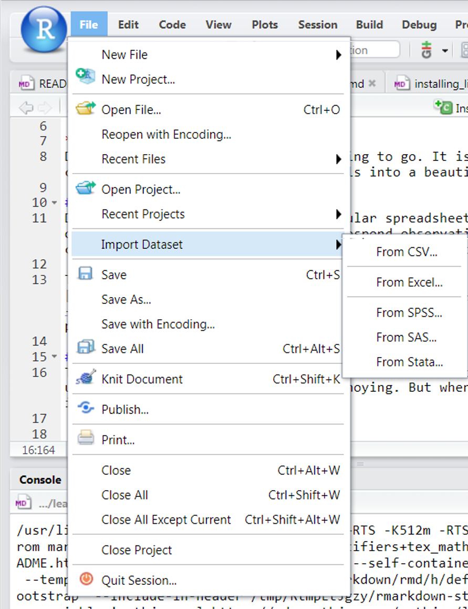

***
Data frames are where the data is going to go. It is the brisket that we will carve up using our data analysis tools into a beautiful sunday evening dish. 

### Data frames
Data frames are analogous to rectangular spreadsheets: they are representations of datasets in R where the rows correspond observations and the columns correspond to variables that describe the observations.

To get some practice with data frames go to another data camp exercise: [datacamp](https://campus.datacamp.com/courses/free-introduction-to-r/chapter-5-data-frames?ex=1). This ones not really as good as the first one for our purposes so there's more to do here o_0.

### The first thing
The first thing is getting your data into R. This took me a long time to really understand. It is in fact kind of annoying. But when you get it, its all worth it. 

There are a bunch of ways to load data into R. Some come pre-built into R, some Rstudio based, some based on packages. I don't know all of them, I just know what I use. 

I don't generally use the Rstudio program to load these files, but you can and its convenient.

The picture below shows the menu options to use to load data through Rstudio.
 

This command will get you to a pop-up that will ask you to navigate to your file of interest, and then it will try to autodetect a bunch of things about it. You can also set a bunch of options there to fine-tune how the load works. You can also get to this menu by clicking on the file you want in the file explorer tab in the lower right window pane of Rstudio.

Alternatively, you can, if you want, use a package to do it. Lets use a package I like called readR. 

This section below puts a little space where I can put code that you can execute and see the results, kind of like the datacamp site.

```{r}

#load readr package
install.packages('readR')#This won't work, i dont think I mentioned, but R is case sensitive, VERY case sensitive.

install.packages('readr')
library(readr)

```


Now that the package we will use to import the data is all loaded up, we can try to load a file. We will start with a .csv file. csv stands for comma seperated vector. Its a standard way to save data. You can open up one of these in a notepad to check it out. Excel deals with these natively as well.

We will load the data with read_csv function in the readr package. This function can take a bunch of arguments (arguments, or options, are how you tweak the way the function will work) available. The only required argument is `file`, which is a path to a CSV file on your computer (or the web!).

```{r csv load}
#The command below loads the creatinine data into a variable. You can name the variable whatever your little heart desires, but i will call it creatinine.df

creatinine.df<-read_csv("data/creatinine.csv")
#Yeah, the quotes are necessary. If we didnt use quotes up in there it would think that we were referring to a variable call creatinine.csv and go around looking for it. 

```

The red stuff that appeared are some information about what the function did. In this case its telling you that it called the age column an integer, and creatclear a double, (which is like an integer). You can actually tweak these by entering arguments into the read_csv function, but we will deal with this some other time.


What about excel files? Of course R can take care of that. We will use another package called readxl.

```{r readxl}
install.packages('readxl')
library(readxl)

#This function tells you the names of the worksheets in the excel file
excel_sheets('data/bloodpressure.xlsx')

#This function reads it in. The sheet option tells the function which sheet we want to read. Because this file only has one sheet it wasn't necessary.
bloodpressure.df<-read_excel('data/bloodpressure.xlsx',sheet = 'bloodpressure')

```

###Exploring the data in the creatinine.df
The data in there can be initially explored in bunch of ways. 

You can just print all the data out by typing the name of the data frame variable

```{r print}
bloodpressure.df
```


You can get the names of the columns in the data frame using names()
```{r names}
names(bloodpressure.df)
```


Head shows the first few rows of the data frame
```{r head}
head(creatinine.df)
```


str shows the different kinds of columns, and whats going on in there.

```{r str}
str(creatinine.df)
```


summary() shows some basic statistics of whats in there.

```{r summary}
summary(creatinine.df)
```

Finally, View() will actually display the data frame in one of the tabs above the upper left Rstudio frame. Its really useful.

```{r View}
View(creatinine.df)
```


The $ sign allows us to explore a single variable within a data frame. For example

```{r}
bloodpressure.df$systolic
#This will print out all the values in the column systolic
```

###Deeper dive
Now I mentioned earlier that each column of the data frame gets its own variable type or class, e.g. numeric, character, date. This is important because R will not let you take an average of a column that it thinks is full of characters even if you think that all the data is numerical. Also, it might think a column is full of numbers, but they are actually full of dates, or maybe patient numbers (which I guess are numbers, but really aren't.) 

How do we figure out what kind of columns are in our dataframe. well you can use the tools above. You can also go to your upper right pane, the environemnt tab has all the variables and dataframes, and you can click on the arrow to get more info.

But say we want to change that class of the column, how do you do it? You COERCE it into the one you want.

See the 'subject' column in the bloodpressure.df dataframe. Its now encoded as a numeric, but maybe we want to treat it more like a character, because we don't really want to do sums and means with those numbers. here's what we would do.

```{r coerce}
#OK now this is the real deal with R
#We'll go through this step by step
#You can access a single column in a dataframe with the dollar sign
#This will pring out all the values in the column subject
bloodpressure.df$subject

#You can access the class of something by wrapping it in the class() function
class(bloodpressure.df$subject)

#Finally, R lets you modify these things with the <- sign
class(bloodpressure.df$subject)<-'character'

#Check we did a good job
class(bloodpressure.df$subject)
bloodpressure.df$subject


```

Note all those quotation marks. They are there because those values arent really numbers, they are "numbers" meaning character strings that are just composed of number characters.

OK We are done here
